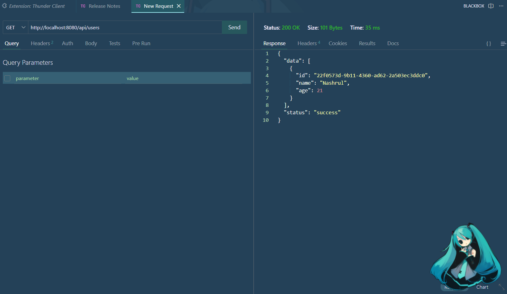
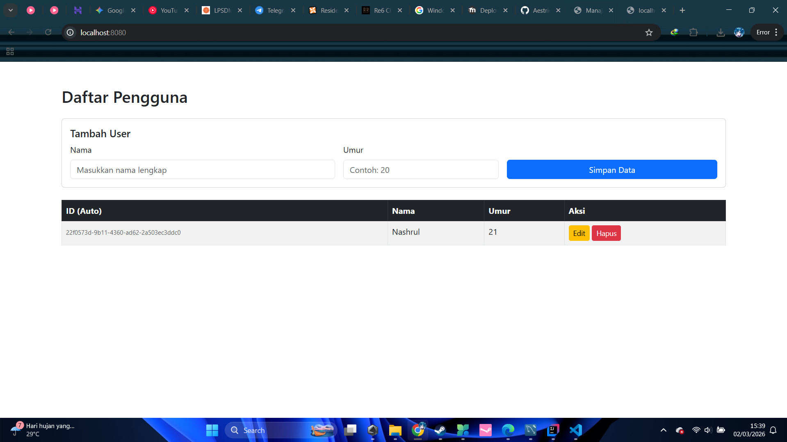

# Praktikum 1 - Deployment Perangkat Lunak
**Implementasi CRUD User dengan Spring Boot & MapStruct**

## 📋 Deskripsi Project
Project ini adalah tugas Praktikum 1 untuk mata kuliah Deployment Perangkat Lunak. Aplikasi ini mengimplementasikan RESTful API untuk pengelolaan data User (Create, Read, Update, Delete) menggunakan arsitektur yang bersih dengan pemisahan antara Entity, DTO, dan Mapper.

## 🛠️ Tech Stack
- **Java:** 21
- **Framework:** Spring Boot 4.0.3
- **Database:** MySQL
- **Library Utama:**
    - Spring Data JPA (Persistensi Data)
    - MapStruct (Object Mapping)
    - Lombok (Boilerplate reduction)
    - Jakarta Validation (Validasi Input)

## 🚀 Fitur API
- `POST /api/users` - Menambah user baru
- `GET /api/users` - Mendapatkan semua daftar user
- `GET /api/users/{id}` - Mendapatkan detail user berdasarkan ID
- `PUT /api/users/{id}` - Memperbarui data user
- `DELETE /api/users/{id}` - Menghapus data user

**Screenshoot**

## 👤 Identitas Mahasiswa
- **Nama:** Nashrul Fikri
- **NIM:** 20230140105
- **Prodi:** Teknologi Informasi
- **Instansi:** Universitas Muhammadiyah Yogyakarta